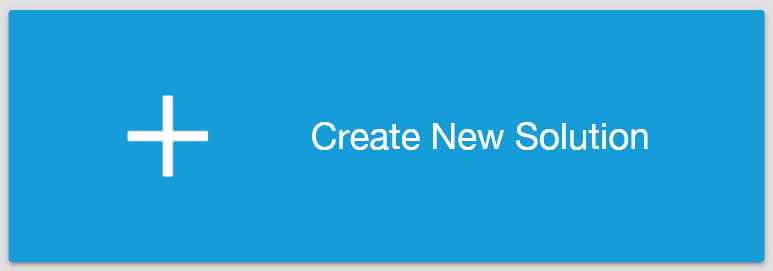

# Usage

## Starting the Application

1. Open the application
2. Log in with your credentials

---

## Creating a Project

1. Click **New Project**
2. Enter project name
3. Click **Create**

---

[⬅ Previous: Installation](installation.md) | [Back to Index 🏠](./README.md) | [Next: Troubleshooting ➡](troubleshooting.md)